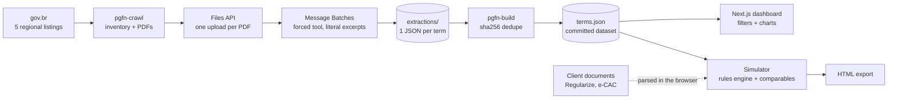

# tax-settlement-analytics

Analytics on 1,134 individual tax settlement terms published by Brazil's National Treasury Attorney (PGFN), plus a simulator that checks a client's settlement proposal against the law and against what the PGFN has actually accepted in similar cases. Built for a tax law team and in use since August 2026; rebranded and anonymised here.

 

**Status:** in production (law firm tax team) · **Runs offline:** yes, `DEMO_MODE=true` needs no key and no account · **Data:** public, committed, rebuildable

## The problem

When a company owes the federal treasury more than BRL 10 million it can negotiate an individual settlement: a discount on fines, interest and charges, a payment term, guarantees. The law sets the ceilings (65 % or 70 %, 120 or 145 months) but says nothing about what the Attorney actually accepts, and the only evidence is the signed terms themselves: more than a thousand PDFs scattered across five regional pages of gov.br. Lawyers calibrated proposals on anecdote, and the legal arithmetic lived in a spreadsheet nobody trusted with a client. The team needed the whole corpus as data, and a simulator that put a specific case next to it.

## What it does

- Collects every published settlement term from the five PGFN regional listings and extracts the negotiated conditions (amount, discount by component, instalments, down payment, guarantees, judicial recovery, special clauses) with a quotation from the document for every number.
- Shows the market: discounts actually granted by region, debt band and component, guarantee patterns, treatment of companies in judicial recovery, approvals per year; every row links to the original PDF.
- Simulates one client's case under the two modalities (TI and TIS): legal caps by size class and payment capacity, judicial-recovery regime, tax-loss offset, escalating signature requirements, down payment and instalment schedule with the social-security 60-month cap.
- Confronts the simulated scenario with the closest real terms and reports an *adherence* index: how much the proposal resembles conditions the PGFN has already accepted.
- Imports the debt from the taxpayer's own documents (PGFN Regularize report, revenue-service statements) inside the browser, de-duplicates across documents and cross-checks what is missing.
- Exports a self-contained HTML report for the client and keeps a prioritised review queue for the extraction's weak spots.

## Architecture



The pipeline (Python) is four small commands with a JSON registry as state: crawl, extract, extract in batches, build. Extraction is one Claude call per document with the PDF attached and a single tool the model is forced to call; the tool schema requires a `source_excerpts` quotation for every numeric field, a confidence per field and a list of fields to review. The dataset is a versioned JSON file served statically. The web app (Next.js, TypeScript) has no database: sessions are HMAC-signed cookies, the corpus is fetched once, and everything the simulator does, including PDF parsing, runs in the browser.

## Design decisions

- **Files API plus Message Batches, not inline PDFs or an agentic loop.** The first backlog run inlined PDFs as base64 and a 150 MB batch upload dropped the connection. Each PDF is now uploaded once (small, individually retryable) and batches reference only the `file_id`, at half the synchronous price. The flow is resumable from two state files. Cost: results arrive in hours, fine for a backlog; the synchronous command remains for the daily increment.
- **A quotation for every number.** The extraction tool will not accept a figure without the sentence it came from, and image-only pages must be reported as `document_unreadable` instead of guessed. This made the corpus auditable (the review queue opens the PDF next to the excerpt) and kept the model from inventing consolidated amounts when a term only states per-annex figures: the value is null and flagged, not fabricated. Cost: lower coverage (57 % of terms have an amount).
- **Legal rules are code, not prompts.** Caps, terms, thresholds and signature rules are a deterministic module with one hand-computed test per scenario, including the judicial-recovery reading validated with the head of tax (the size-class cap is kept; recovery changes the CAPAG presumption and the term, not the ceiling). A language model never touches a legal rule.
- **Adherence, not probability.** The corpus contains only approved agreements; the PGFN does not publish rejections, so there is no denominator for a "chance of success". The comparables panel says how the proposal sits against accepted conditions (discount, term, down payment) and states the survivorship caveat in the UI and in the export. Amendments and renegotiations are excluded because their "discount" is not a fresh concession and distorts medians.
- **Client data never leaves the browser.** The importer sniffs file types by magic bytes, parses PDFs with pdf.js and spreadsheets with a hand-written CSV reader, all client-side. There is no upload route to add, by design. Cost: no server-side OCR for scanned statements.
- **Keyword categorisation instead of a second model pass.** Sector came back as 699 distinct strings for 1,202 terms; guarantees and clauses were similar. Ordered keyword rules reduce them to a dozen categories each, deterministically and testably, with an explicit "Other" bucket so nothing disappears. Cost: an occasional misfile, visible and fixable in one table.
- **The repository is the database.** The dataset is committed and rebuilt from the per-document extractions; the dashboard is a static export plus two auth routes. Cost: a 4.3 MB JSON on first load, cached afterwards.

## How AI was used

- **Generated:** the original Portuguese version was written with an AI coding assistant over ten weeks against the real corpus and real client documents; this English version was produced by translating and restructuring it with the same assistant, mapping every field name once at the data boundary.
- **Rewritten by me:** the legal readings (recovery cap, TIS thresholds, signature tiers) came from the legislation and from review with the tax team, not from the model; the e-CAC parsers were rewritten after real statements broke items across page boundaries; the extraction moved from inline PDFs to the Files API after the failed 150 MB upload.
- **Validated:** 179 web tests and 10 pipeline tests run offline; every rule scenario is computed by hand in the test; the extraction has a sampling plan for human certification (below) and a review queue that orders the work.
- **Rejected:** prompt caching on the attached document (it made ingestion of scanned PDFs unstable in the pilot, and each PDF is read once anyway); a version of the schedule that kept a down-payment phase at 0 % and left month 1 empty; five records where the model wrote an explanation into a numeric field were nulled and flagged during migration rather than parsed.
- **Commits:** made with an AI coding assistant; attribution trailers are omitted and AI usage is documented here.

## Evaluation

The extraction is the only model in the loop. The pilot validation found the discount to be the least reliable field (about 89 % on the pilot sample), so the review queue orders it first: 12 terms with a discount above the legal 70 % cap (impossible values) come before the 432 terms whose discount confidence is below 0.7. The certification plan is fixed-size, not proportional: 60 terms drawn deterministically by hash of the id, times 3 key fields, gives 180 checks; with at most 4 errors, the lower bound of the exact binomial 95 % interval stays above 95 %. Details and coverage figures are in [docs/DATA.md](docs/DATA.md).

| Measure | Value | Set |
|---|---|---|
| Terms with a stated instalment count | 86 % | 1,134 terms |
| Terms with a stated total discount | 66 % | same |
| Terms with a stated consolidated amount | 57 % | same |
| Discounts above the legal cap (flagged, not published as valid) | 12 | same |
| Image-only or incomplete documents flagged instead of guessed | 11 | same |

## Cost & latency

The full initial load (1,210 documents) was budgeted at about BRL 600 (roughly USD 110) using Message Batches at half price; the per-document cost was measured on a 30-document pilot before the rest was authorised. Batches complete within hours; the synchronous command takes tens of seconds per document and is used for the daily increment. The dashboard fetches one 4.3 MB JSON and every filter recomputes in the browser; the simulator's imports parse a 50-page statement in about a second.

## Known failure modes

- **Scanned or image-only PDFs** yield nothing: the record is flagged `document_unreadable` with all values null. No OCR is attempted.
- **Very long PDFs** are read up to the first 100 pages; one 658-page term is flagged `document_truncated`.
- **Terms with per-annex conditions** (two discounts, two terms) have no consolidated figure; the fields are null and flagged rather than averaged.
- **Free-text categorisation** can misfile an unusual sector or guarantee into "Other"; the categories are ordered rules in one file, and the explorer keeps the original text.
- **Regularize spreadsheets carry no components**, so their totals are booked as principal with a visible warning; the detailed PDF is needed for a correct discount base.
- **Survivorship bias** in the comparables is structural: only approved terms exist. The UI says so wherever the index appears.

## Data & privacy

The corpus is public information published by the Brazilian federal government about settlements with legal entities; company names and corporate tax ids are as published. Four records identifying natural persons were removed before publication and stay out. The simulator processes a client's documents entirely in the browser; the app stores nothing about them and has no analytics. Sessions are signed cookies; credentials come from environment variables. The system is decision support: a lawyer reviews every figure, and the export says so.

## Tests & CI

`npm test` in `web/` runs 179 checks through Node's native type stripping (no framework): the rules engine scenario by scenario, the comparables selection and adherence index, the e-CAC and Regularize parsers on synthetic statements, the multi-document aggregation, the categorisers and the deterministic sample. `uv run pytest` in `pipeline/` runs 10 tests: schema validation, registry, crawler parsing against fixture HTML, simulated extraction, dedupe and dataset build. CI runs typecheck, tests and the production build for the web app, lint, tests and a dataset rebuild for the pipeline, and a gitleaks scan.

## Stack

`TypeScript` `Next.js 15` `React 19` `Tailwind v4` `Recharts` `pdf.js` `Python 3.12` `uv` `Anthropic SDK (Files API, Message Batches)` `Pydantic` `pytest` `ruff` `GitHub Actions` `Vercel`

## Running locally

```bash
git clone https://github.com/fillipeml/tax-settlement-analytics
cd tax-settlement-analytics/web
npm ci
DEMO_MODE=true npm run dev        # http://localhost:3000, signed in automatically
npm test

cd ../pipeline
uv sync
uv run pytest -q
uv run pgfn-build                 # rebuild web/public/data/terms.json from the extractions
```

Deploying the demo: import the repository on Vercel with **Root Directory** set to `web` and the environment variable `DEMO_MODE=true`. For a real deployment set `SESSION_SECRET` and `APP_USERS` (see `web/.env.example`) and leave `DEMO_MODE` unset.

## Demo mode

`DEMO_MODE=true` signs visitors in automatically and accepts the pair `demo` / `demo`; nothing else changes, because the dashboard already runs on the committed public dataset and the simulator already runs client-side. The pipeline's `pgfn-extract --simulated` produces clearly flagged placeholder records without an API key. See [docs/DEMO.md](docs/DEMO.md) for the three-minute walkthrough.

## What I'd do next

- Finish the human certification on the 60-term sample and publish the measured field accuracies here.
- Schedule the crawl and the synchronous extraction as a GitHub Action so new terms land as dataset commits.
- Move the extraction to structured outputs (`json_schema`) now that they are generally available, and compare rejection rates against the forced-tool approach.

## Glossary

Brazilian legal terms kept in Portuguese are explained in [docs/GLOSSARY.md](docs/GLOSSARY.md). The dataset is described in [docs/DATA.md](docs/DATA.md).

## Licence

MIT
